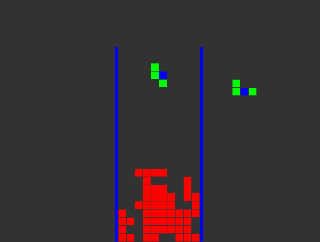
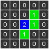
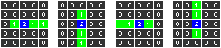
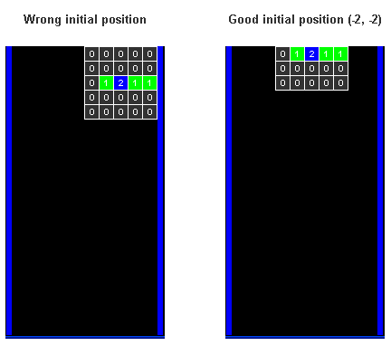

## C++打造俄罗斯方块的教程
	
如何使用C++从零创建一个俄罗斯方块游戏。

### 环境安装及游戏设计
ubuntu 18.04
仅仅依赖于SDL框架。
```sh
sudo apt-get install libsdl1.2-dev libsdl-gfx1.2-dev
```

这个游戏支持以下几种操作

| 键盘按键  |    操作说明        |
|---|------------|
|ESC|	离开游戏          |
|z	 |旋转方块
|x	 |方块快速下降         |
|Left,Right, Down |	这是什么操作不需要介绍吧 |


### step0:介绍

这个教程只关注游戏逻辑的实现。

**在创建俄罗斯方块我们只需要关注4个问题**:

1. 如何使用矩阵(多维数组)存储棋子和棋盘。(方块和地图)

2. 如何解决俄罗斯方块的旋转问题，以一种非常简单的方式，不使用复杂的数学或任何困难的东西，。

3. 如何检查方块和地图之间的碰撞。

4. 俄罗斯方块游戏的主循环是如何工作的。

效果图如下:




### step1:创建方块(方块怎么存储以及旋转)

创建一个用于存储所有片段的类。有7种不同类型的块:正方型、I型、L型、L型镜像、N型、N型镜像和t型。如图:



这一块是在一个矩阵5×5的俄罗斯方块。0表示“无块”，1表示“正常块”，2表示“旋转块”。旋转块2是主块:俄罗斯方块游戏每一块都有一个旋转块。

使用一个5×5英寸的二维数组(或者字节，字节是最优解但实现复杂)。刚刚如图的俄罗斯方块在代码中是这样的:

```C
{0, 0, 0, 0, 0},
{0, 0, 0, 1, 0},
{0, 0, 2, 1, 0},
{0, 0, 1, 0, 0},
{0, 0, 0, 0, 0}
```

现在已经知道如何存储每一块了然后来考虑一下旋转。可以用很多不同的方法来解决旋转问题。在其他教程中，我看到过他们使用复杂的旋转代数来旋转块。但有更简单的办法解决这个问题。如果能储存每一块，为什么我们不把每一块的所有状态也储存起来呢?每一块有四种可能的状态:




较长的一块只有4块宽。但是我用了5个分块矩阵来存储所有旋转对主块的响应。在我实现的前一个版本中，我使用了4块矩阵，但是之后需要存储主元到原点的转换。所以我采用5个分块，这样会多使用了一些字节，但是源代码更简洁。总的来说，我们只使用448个字节来存储所有的片段。

因此，为了存储所有这些信息，我们需要一个4维数组，为了存储每一块的4个可能的旋转(5×5矩阵):
```C
// 块定义
char mPieces [7 /*块种类 */ ][4 /* 旋转状态 */ ][5 /* 水平方格 */ ][5 /* 垂直方格 */ ] =
{
// 方形
  {
   {
    {0, 0, 0, 0, 0},
    {0, 0, 0, 0, 0},
    {0, 0, 2, 1, 0},
    {0, 0, 1, 1, 0},
    {0, 0, 0, 0, 0}
    },
   {
    {0, 0, 0, 0, 0},
    {0, 0, 0, 0, 0},
    {0, 0, 2, 1, 0},
    {0, 0, 1, 1, 0},
    {0, 0, 0, 0, 0}
    },
   {
    {0, 0, 0, 0, 0},
    {0, 0, 0, 0, 0},
    {0, 0, 2, 1, 0},
    {0, 0, 1, 1, 0},
    {0, 0, 0, 0, 0}
    },
   {
    {0, 0, 0, 0, 0},
    {0, 0, 0, 0, 0},
    {0, 0, 2, 1, 0},
    {0, 0, 1, 1, 0},
    {0, 0, 0, 0, 0}
    }
   },
 
// I
  {
   {
    {0, 0, 0, 0, 0},
    {0, 0, 0, 0, 0},
    {0, 1, 2, 1, 1},
    {0, 0, 0, 0, 0},
    {0, 0, 0, 0, 0}
    },
   {
    {0, 0, 0, 0, 0},
    {0, 0, 1, 0, 0}, 
    {0, 0, 2, 0, 0},
    {0, 0, 1, 0, 0},
    {0, 0, 1, 0, 0}
    },
   {
    {0, 0, 0, 0, 0},
    {0, 0, 0, 0, 0},
    {1, 1, 2, 1, 0},
    {0, 0, 0, 0, 0},
    {0, 0, 0, 0, 0}
    },
   {
    {0, 0, 1, 0, 0},
    {0, 0, 1, 0, 0},
    {0, 0, 2, 0, 0},
    {0, 0, 1, 0, 0},
    {0, 0, 0, 0, 0}
    }
   }
  ,
// L
  {
   {
    {0, 0, 0, 0, 0},
    {0, 0, 1, 0, 0},
    {0, 0, 2, 0, 0},
    {0, 0, 1, 1, 0},
    {0, 0, 0, 0, 0}
    },
   {
    {0, 0, 0, 0, 0},
    {0, 0, 0, 0, 0},
    {0, 1, 2, 1, 0},
    {0, 1, 0, 0, 0},
    {0, 0, 0, 0, 0}
    },
   {
    {0, 0, 0, 0, 0},
    {0, 1, 1, 0, 0},
    {0, 0, 2, 0, 0},
    {0, 0, 1, 0, 0},
    {0, 0, 0, 0, 0}
    },
   {
    {0, 0, 0, 0, 0},
    {0, 0, 0, 1, 0},
    {0, 1, 2, 1, 0},
    {0, 0, 0, 0, 0},
    {0, 0, 0, 0, 0}
    }
   },
// L mirrored
  {
   {
    {0, 0, 0, 0, 0},
    {0, 0, 1, 0, 0},
    {0, 0, 2, 0, 0},
    {0, 1, 1, 0, 0},
    {0, 0, 0, 0, 0}
    },
   {
    {0, 0, 0, 0, 0},
    {0, 1, 0, 0, 0},
    {0, 1, 2, 1, 0},
    {0, 0, 0, 0, 0},
    {0, 0, 0, 0, 0}
    },
   {
    {0, 0, 0, 0, 0},
    {0, 0, 1, 1, 0},
    {0, 0, 2, 0, 0},
    {0, 0, 1, 0, 0},
    {0, 0, 0, 0, 0}
    },
   {
    {0, 0, 0, 0, 0},
    {0, 0, 0, 0, 0},
    {0, 1, 2, 1, 0},
    {0, 0, 0, 1, 0},
    {0, 0, 0, 0, 0}
    }
   },
// N
  {
   {
    {0, 0, 0, 0, 0},
    {0, 0, 0, 1, 0},
    {0, 0, 2, 1, 0},
    {0, 0, 1, 0, 0},
    {0, 0, 0, 0, 0}
    },
   {
    {0, 0, 0, 0, 0},
    {0, 0, 0, 0, 0},
    {0, 1, 2, 0, 0},
    {0, 0, 1, 1, 0},
    {0, 0, 0, 0, 0}
    },
   {
    {0, 0, 0, 0, 0},
    {0, 0, 1, 0, 0},
    {0, 1, 2, 0, 0},
    {0, 1, 0, 0, 0},
    {0, 0, 0, 0, 0}
    },
 
 
 
   {
    {0, 0, 0, 0, 0},
    {0, 1, 1, 0, 0},
    {0, 0, 2, 1, 0},
    {0, 0, 0, 0, 0},
    {0, 0, 0, 0, 0}
    }
   },
// N mirrored
  {
   {
    {0, 0, 0, 0, 0},
    {0, 0, 1, 0, 0},
    {0, 0, 2, 1, 0},
    {0, 0, 0, 1, 0},
    {0, 0, 0, 0, 0}
    },
   {
    {0, 0, 0, 0, 0},
    {0, 0, 0, 0, 0},
    {0, 0, 2, 1, 0},
    {0, 1, 1, 0, 0},
    {0, 0, 0, 0, 0}
    },
   {
    {0, 0, 0, 0, 0},
    {0, 1, 0, 0, 0},
    {0, 1, 2, 0, 0},
    {0, 0, 1, 0, 0},
    {0, 0, 0, 0, 0}
    },
   {
    {0, 0, 0, 0, 0},
    {0, 0, 1, 1, 0},
    {0, 1, 2, 0, 0},
    {0, 0, 0, 0, 0},
    {0, 0, 0, 0, 0}
    }
   },
// T
  {
   {
    {0, 0, 0, 0, 0},
    {0, 0, 1, 0, 0},
    {0, 0, 2, 1, 0},
    {0, 0, 1, 0, 0},
    {0, 0, 0, 0, 0}
    },
   {
    {0, 0, 0, 0, 0},
    {0, 0, 0, 0, 0},
    {0, 1, 2, 1, 0},
    {0, 0, 1, 0, 0},
    {0, 0, 0, 0, 0}
    },
   {
    {0, 0, 0, 0, 0},
    {0, 0, 1, 0, 0},
    {0, 1, 2, 0, 0},
    {0, 0, 1, 0, 0},
    {0, 0, 0, 0, 0}
    },
   {
    {0, 0, 0, 0, 0},
    {0, 0, 1, 0, 0},
    {0, 1, 2, 1, 0},
    {0, 0, 0, 0, 0},
    {0, 0, 0, 0, 0}
    }
   }
};
```

现在，旋转一块方块，只需要选择下面存储的旋转后的一块就可以了。这样就是通过状态机的方式实现了旋转过程。

有一件重要的事必须考虑进去。每次在屏幕顶部创建时，必须正确地定位每个不同的块。换句话说，它需要被放入到正确的位置(为了在黑板上只显示一排方块，并且居中，上面的方块应该在黑板外面)。就像每一块都是不同的(有些比矩阵中的其他部分更低或更小)，每一块都需要在每次创建时进行不同的转换。我将把这些转换存储在另一个数组中，每个旋转后的块存储一个转换。如下图:



必须为每一块存储是两个指标(水平平移，垂直平移)。以后的“游戏”类中将使用这些数字，在每次出现新块时创建块，这样它将在正确的位置初始化。这是存储这些指标的数组:

```C
// 在创建时，将块移动到它最初在板中绘制的位置
int mPiecesInitialPosition  [7 /*种类 */ ][4 /* 回转 */ ][2 /* 位置 */] =
{
/* Square */
  {
    {-2, -3}, 
    {-2, -3},
    {-2, -3},
    {-2, -3}
   },
/* I */
  {
    {-2, -2},
    {-2, -3},
    {-2, -2},
    {-2, -3}
   },
/* L */
  {
    {-2, -3},
    {-2, -3},
    {-2, -3},
    {-2, -2}
   },
/* L mirrored */
  {
    {-2, -3},
    {-2, -2},
    {-2, -3},
    {-2, -3}
   },
/* N */
  {
    {-2, -3},
    {-2, -3},
    {-2, -3},
    {-2, -2}
   },
/* N mirrored */
  {
    {-2, -3},
    {-2, -3},
    {-2, -3},
    {-2, -2}
   },
/* T */
  {
    {-2, -3},
    {-2, -3},
    {-2, -3},
    {-2, -2}
   },
};
```

至此，已经解决了最棘手的部分之一。

现在可以创建我们的Pieces类，这个文件被称为“piece .h”:

```C
#ifndef _PIECES_
#define _PIECES_
 
 
// --------------------------------------------------------------------------------
//                                   Pieces
// --------------------------------------------------------------------------------
 
class Pieces
{
public:
 
    int GetBlockType        (int pPiece, int pRotation, int pX, int pY);
    int GetXInitialPosition (int pPiece, int pRotation);
    int GetYInitialPosition (int pPiece, int pRotation);
};
 
#endif // _PIECES_
```

```C
/*                                  
* 返回一个块的类型(0 =无块，1 =正常块，2 =主块) 
* 参数:
* @pPiece:    一个块
* @pRotation: 四种可能的旋转中的一种
* @pX:        块体水平位置
* @pY:        块体垂直位置
*/
int Pieces::GetBlockType (int pPiece, int pRotation, int pX, int pY)
{
    return mPieces [pPiece][pRotation][pX][pY];
}
 
 
/*                                  
* 返回生成块的水平位移值，以便将其创建在正确的位置。
* 参数:
* @pPiece:    一个块
* @pRotation: 四种可能的旋转中的一种
*/
int Pieces::GetXInitialPosition (int pPiece, int pRotation)
{
    return mPiecesInitialPosition [pPiece][pRotation][0];
}
 
 
/*                                  
* 返回待生成块的垂直位移值，以便将其创建在正确的位置。
* 参数:
* @pPiece:    一个块
* @pRotation: 四种可能的旋转中的一种
*/
int Pieces::GetYInitialPosition (int pPiece, int pRotation)
{
    return mPiecesInitialPosition [pPiece][pRotation][1];
}
```